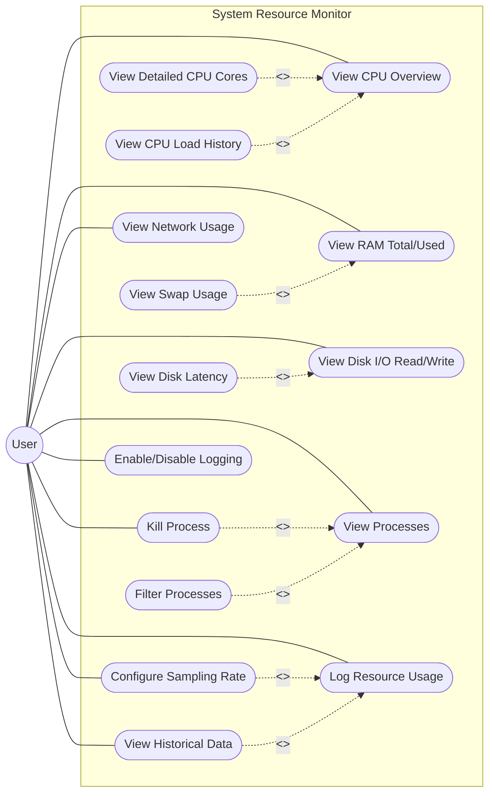

# 💻 Real-Time System Resource Monitor

A high-performance, native Windows system resource monitor built in **C++** using **Object-Oriented Design Patterns (OODP)**. 

This application fetches live hardware metrics (CPU, RAM, Disk, and Process memory) using deep Windows APIs and renders them in a beautiful, hardware-accelerated GUI using **Dear ImGui** and **DirectX 11**.

## ✨ Features
* **Live Hardware Telemetry:** Accurately tracks CPU load, Physical RAM consumption, and Disk Space.
* **Top Processes Tracking:** Scans running applications to display the top 5 memory-heavy processes in real-time.
* **Hardware-Accelerated UI:** Replaced standard console output with a fluid, 60fps graphical interface.
* **Zero Flicker:** Uses ImGui's immediate-mode rendering instead of legacy terminal clearing.
* **Standalone Executable:** Fully statically linked—runs out of the box with zero dependencies.

## 🏗️ Architecture & OOP Design
This project was strictly designed using Object-Oriented principles to ensure extensibility and clean code:

* **Abstraction (`Monitor` Base Class):** Defines a strict contract with pure virtual functions like `refresh()` and `renderGUI()`.
* **Inheritance:** Specific hardware components (`CPUMonitor`, `RAMMonitor`, `DiskMonitor`, `ProcessMonitor`) inherit from the base class and implement their own OS-specific fetching logic.
* **Polymorphism:** The `Dashboard` orchestrator manages a polymorphic container (`std::vector<std::unique_ptr<Monitor>>`). During the main application loop, it simply iterates through this collection and calls `.renderGUI()`, entirely relying on dynamic dispatch.
* **Encapsulation:** All underlying Windows API calls (like `GetSystemTimes`, `GlobalMemoryStatusEx`, and `EnumProcesses`) are safely hidden inside their respective classes.

## 🛠️ Tech Stack
* **Language:** C++17
* **Compiler:** MinGW-w64 (MSYS2) / MSVC
* **Graphics API:** DirectX 11
* **UI Framework:** [Dear ImGui](https://github.com/ocornut/imgui)
* **System APIs:** Windows API (`<windows.h>`, `psapi.h`, `pdh.h`, `dwmapi.h`)

## 🚀 How to Run
1. Clone this repository.
2. Run the included `sysmon_gui.exe` file.
*(Note: Because the application queries deep system-level process information, some antivirus software may flag the executable. This is normal for system monitors).*

## 🔨 Compiling from Source
If you wish to compile it yourself using MSYS2 MinGW-w64:
```bash
g++ -std=c++17 -D_WIN32_WINNT=0x0600 -Ivendor/imgui -Ivendor/imgui/backends gui_main.cpp CPUMonitor.cpp RAMMonitor.cpp DiskMonitor.cpp ProcessMonitor.cpp vendor/imgui/imgui.cpp vendor/imgui/imgui_draw.cpp vendor/imgui/imgui_tables.cpp vendor/imgui/imgui_widgets.cpp vendor/imgui/backends/imgui_impl_win32.cpp vendor/imgui/backends/imgui_impl_dx11.cpp -o sysmon_gui.exe -static -lpsapi -ld3d11 -ld3dcompiler -ldxgi -ldwmapi -mwindows
``





